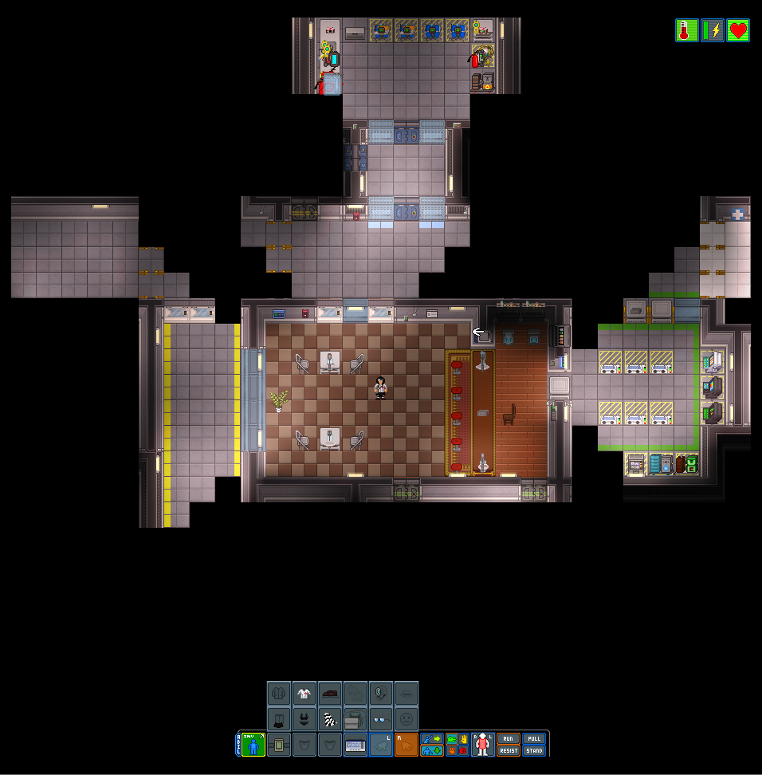
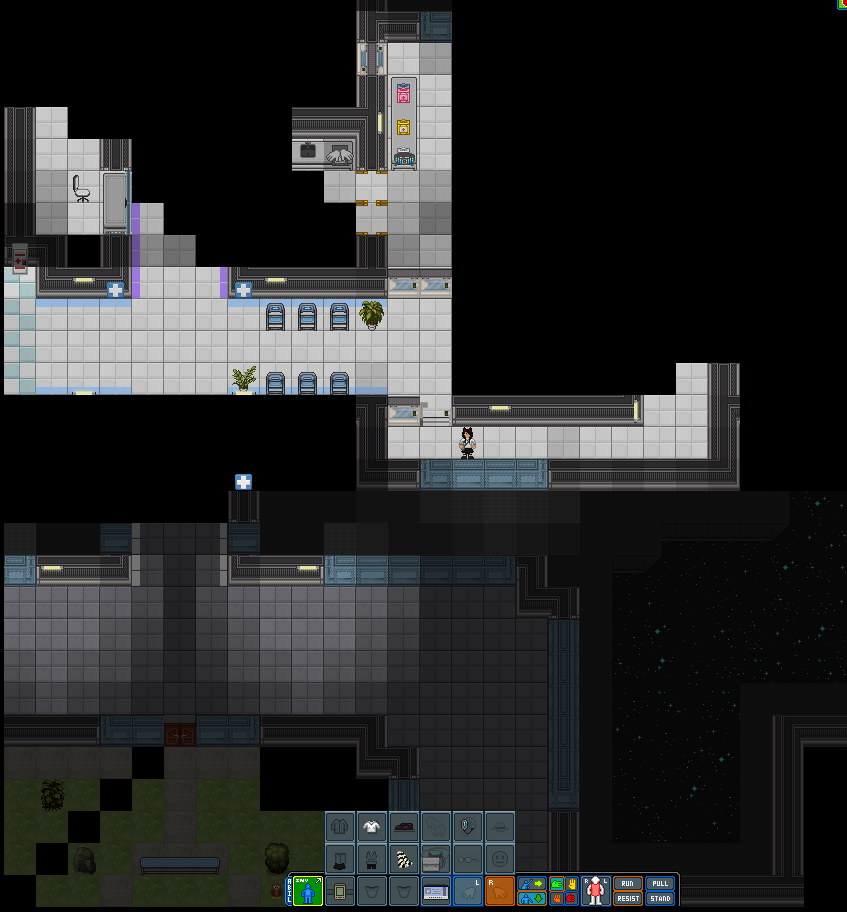
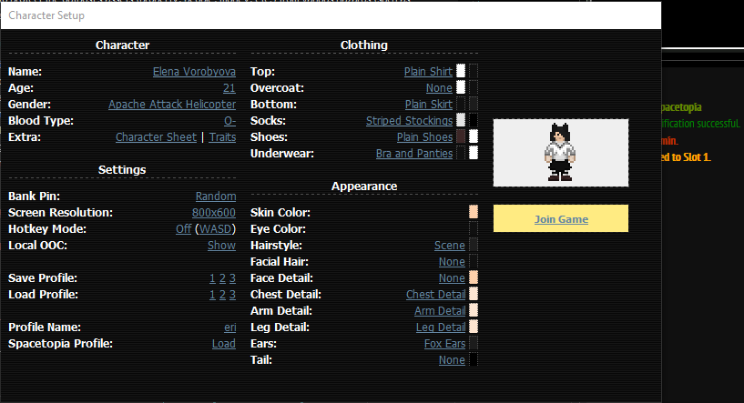
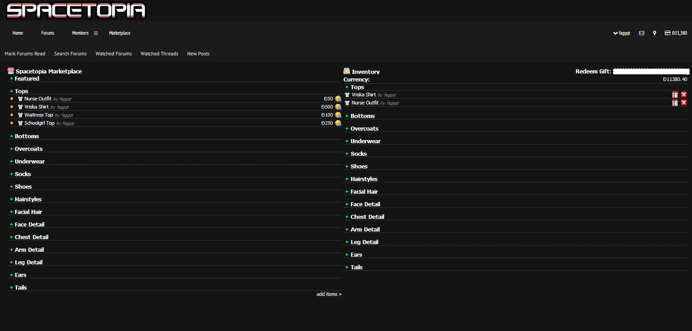
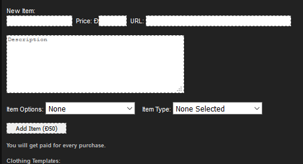
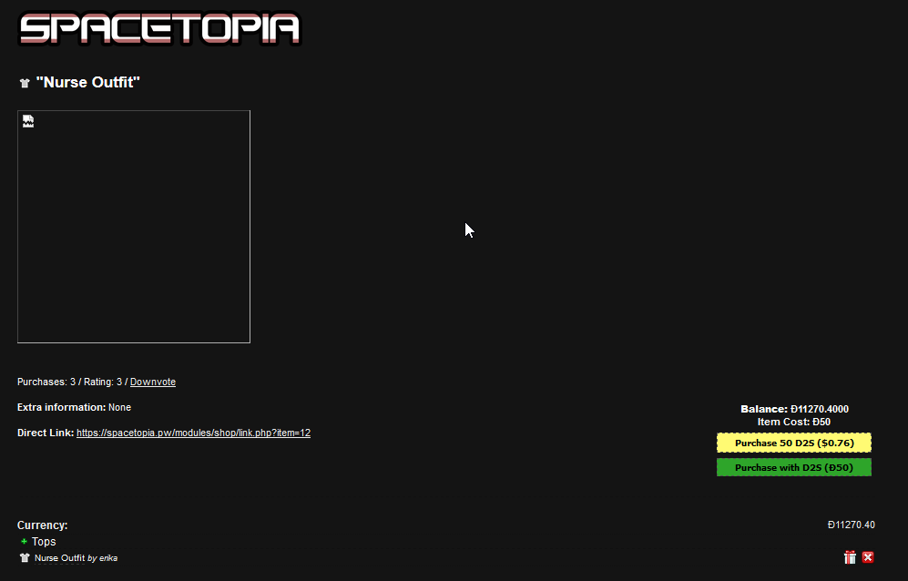
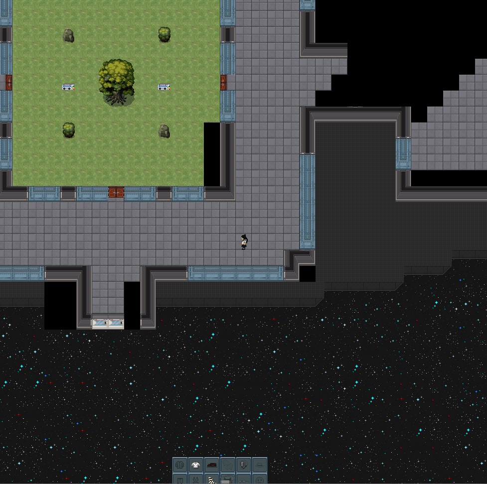
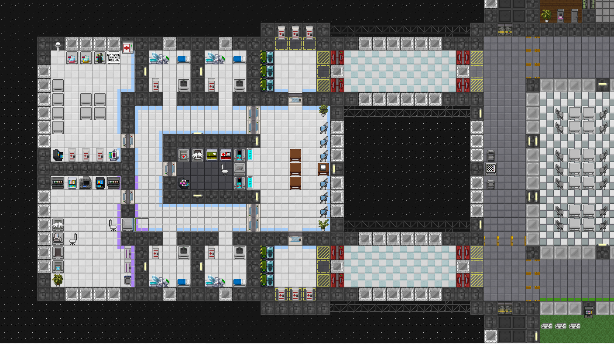
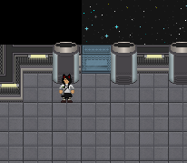
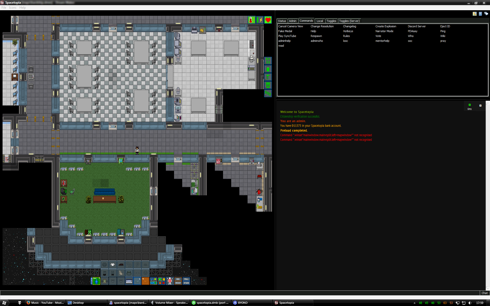

# Spacetopia

A side project which was never finished, intended to bring Second Life-style features and customization into Space Station 13.

"Project Spacetopia is an outpost for science, trade and diplomacy. It is ran by a coalition of different races, governments and planets, and is held under an independent non-profit corporation.  
It has roughly the area of two football fields and has living areas designed to accommodate various alien species and individuals.  
The outpost and its assets are maintained by its loyal engineering and medical staff.  
Security guards are deployed to protect the outpost's assets (property, individuals, money, etc.) from various hazards such as waste, damaged property, unsafe worker behavior, criminal activity) by utilizing preventative measures."

**Features:**

*   A marketplace where users can submit various types of clothing, character details and miscellaneous other vanity items.
*   Users can buy things from the marketplace to apply to their character, items can also be gifted to other users.
*   Extensive character customization with the ability to change your skin tone and color, the detail and color of body parts and the ability to change the style of your body.
*   All outfits/uniforms are separated into tops, bottoms, underwear and socks (with inventory slots for each) for better customization.
*   Clothing selection using clothes from the marketplace is available on the character preference screen.
*   Customizable personal housing with item/storage persistency and the ability to change your furniture/decor.
*   Station doesn't require large amounts of maintenance thus making it perfect for semi-serious and serious roleplay.
*   In-game integration with on-site Spacetopia currency.
*   New game and web UI.
*   Ability to set up extra information/a character sheet.
*   Ability to change resolution/view distance
*   Character preview can be rotated by clicking on it.
*   Players can decide whether to spawn with a satchel or a backpack.
*   Improved sprites for floors, air alarms, APC's and ATMs.
*   More nature sprites.
*   Gender is now a text field.
*   Closets spawn with parts of clothing rather than uniforms.
*   PvP toggle and PvP-only areas (such as exploratory).
*   No permadeath.
*   Players spawn as a civilian by default and can choose an occupation later in-game using a computer.
*   Many sprites, optimizations, fixes and features ported from D2Station.
*   Major improvements upon the API system written for D2Station V4.

**Credits:**

*   Tomeno - Transport lifts, multi-color clothing.
*   Kat - Mapping.

*Based on the gibbed code leak.*

***This codebase is not yet available.***

                  

Licensed under [Creative Commons Attribution-Noncommercial-Share Alike 3.0](http://creativecommons.org/licenses/by-nc-sa/3.0/).
